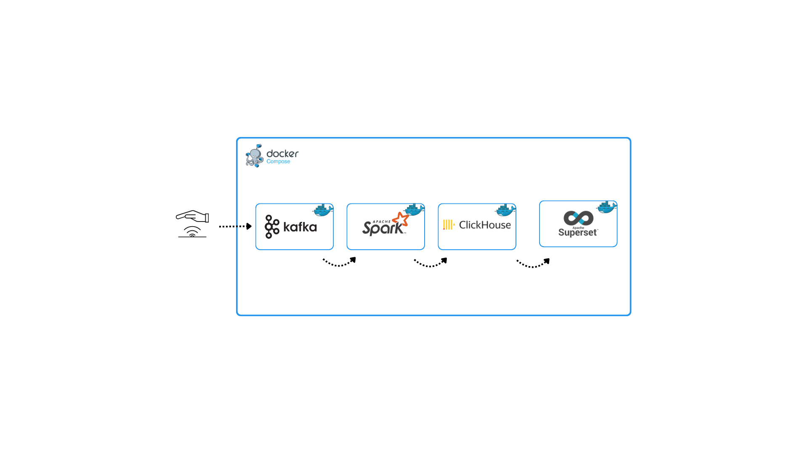
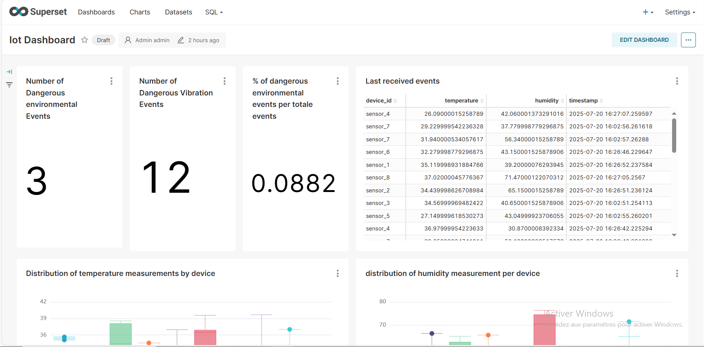
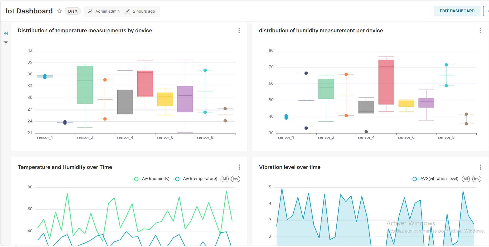
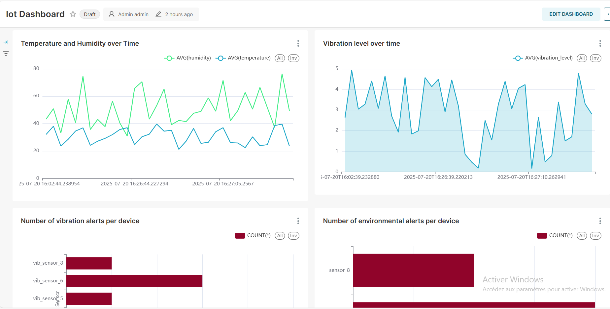
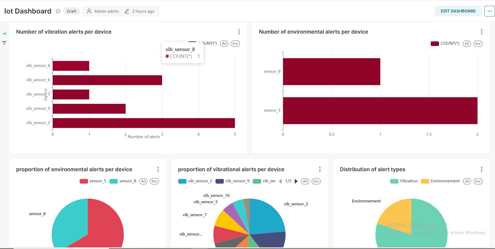
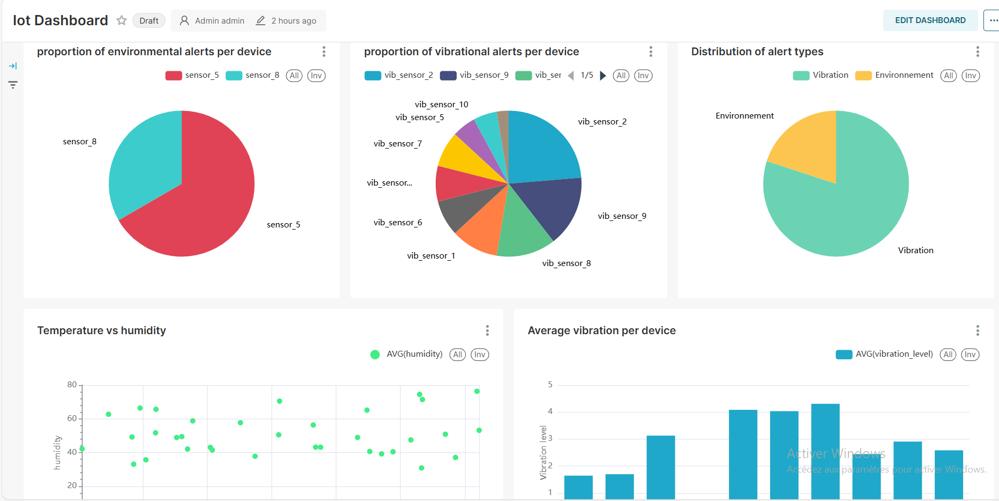
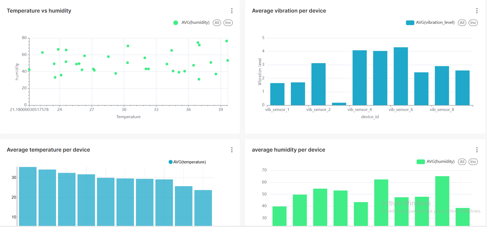
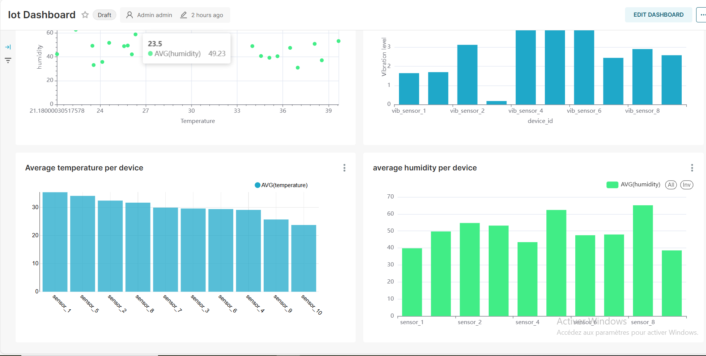

# 🚀 Real-Time IoT Data Infrastructure with Kafka, Spark & ClickHouse



📽️ **Demo Video**: [Watch the demonstration](./assets/video.mp4)

---

## 📌 Project Overview

This project builds a real-time Big Data pipeline that ingests, processes, stores, and visualizes data from IoT sensors. The architecture leverages containerized technologies orchestrated with Docker Compose, making it portable and reproducible.

### 🎯 Objectives:

- Simulate IoT sensor data (temperature, humidity, vibration)
- Ingest data through Apache Kafka
- Process data in real-time using Apache Spark Structured Streaming
- Persist both **normal** and **dangerous** data into ClickHouse
- Visualize insights and alerts using Apache Superset

---

## 🧱 Architecture

- **Kafka**: Ingests IoT data streams
- **Spark**: Consumes Kafka topics, applies logic, and writes data to ClickHouse
- **ClickHouse**: Serves as a fast OLAP database for storing and querying time-series data
- **Superset**: Builds interactive dashboards for business intelligence

---

## ⚙️ Services (Docker Compose)

```yaml
# (Only summarized here – see full docker-compose.yml in this repo)
- kafka: Bitnami Kafka with Kraft mode enabled
- spark-master & spark-worker: Custom Spark image to enable batch/streaming jobs
- clickhouse: Lightweight columnar DB for analytics
- superset: Data visualization and dashboarding tool
All services are configured to communicate internally in the Docker network, with external ports exposed as needed.

🚀 Getting Started
1. Clone the repo:
git clone https://github.com/medamineelrherbi/Iot-Infrastructure-for-Big-data
cd iot-bigdata-pipeline
2. Run the stack:
docker-compose up --build
Wait for all services (especially Spark & ClickHouse) to start. Superset may take ~30 seconds on the first run.

3. Access UIs:
Service	URL	Credentials
Superset	http://localhost:8088	admin / admin
Spark UI	http://localhost:8080	-
ClickHouse	http://localhost:8123	admin / admin

📊 Dashboards (Apache Superset)
Once the pipeline is running, Superset dashboards will present:

Real-Time Temperature & Humidity Monitoring

Vibration Levels per Device

Alert Count and Trend over Time

Device-specific Analysis

📷 Sample Visualizations:









💻 Tech Stack
Tool	Purpose
Kafka	Stream ingestion
Spark	Stream processing
ClickHouse	Fast time-series database
Superset	Dashboards and BI
Docker Compose	Orchestration of services

🧠 How it Works
A Python IoT simulator (run locally) sends JSON messages to Kafka

Spark reads messages using Structured Streaming

It filters “dangerous” combinations (e.g. high temperature + vibration)

Writes two ClickHouse tables: iot_env_all and iot_env_dangerous

Superset queries ClickHouse directly using SQLAlchemy to visualize trends

📁 Project Structure
pgsql
Copier
Modifier
.
├── docker-compose.yml
├── Dockerfile
├── sensor_data_producer.py
├── spark/
│   └── spark_streaming.py
│   └── test_clickhouse.py
├── clickhouse/
│   ├── init.sql
│   └── users.xml
├── assets/
│   ├── architecture.png
│   ├── pictures and videos
├── spark_jars/
└── README.md

👨‍💻 Author
Mohamed Amine El Rherbi

📧 medamineelrherbi@gmail.com

💼 LinkedIn

🧠 Passionate about Big Data, Cloud, and AI

📝 License
This project is licensed under the MIT License.


---
